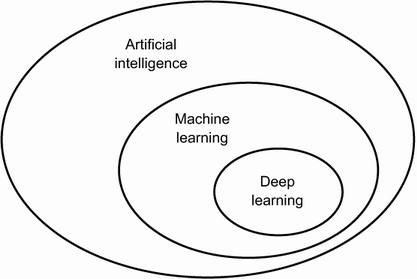
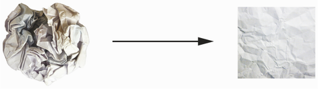

### Chapter 1 What is deep learning?

- "AI can be described as the effort to automate intellectual tasks normally performed by humans."   
<figure>

<figcaption>Fig 1.1 AI, ML and DL</figcaption>
</figure>

- ML learns about rules.
<figure>

<figcaption>Fig 1.2 ML paradigm. "Generalization: the goal of machine learning"</figcaption>
</figure>

- "The central problem in machine learning and deep learning is to *meaningfully transform* data: in other words, to learn useful *representations* of the input data at hand--representations that get us closer to the expected output."  
  - e.g., a CNN transforms pixels into embeddings suitable for classification. 
  - e.g., convert some coordinates from Cartesian to Angular
  
- "These are the two essential characteristics of how deep learning learns from data: *the incremental, layer-by-layer way in which increasingly complex representations are developed*, and the fact that *these intermediate incremental representations are learned jointly*, each layer being updated to follow both the representational needs of the layer above and the needs of the layer below." (**1.2.6 What makes deep learning different**)
  - these enable deep learning to *easily* learn complex features *without feature engineering*, as opposed to shallow learning such as SVM.

### Chapter 2 The mathematical building blocks of neural networks
- "It follows that you can interpret a neural network as a very complex geometric transformation in a high-dimensional space, implemented via a series of simple steps.- "Uncrumpling paper balls is what machine learning is about: finding neat representations for complex, highly folded data *manifolds* in high-dimensional spaces"
<figure>

<figcaption>Fig 2.14 Crumpled ball of two sheets of paper, blue and red. Each layer of NN represents a simple transformation that unscrumples the ball a little bit. </figcaption>
</figure>

### Chapter 3 Introduction to Keras and Tensorflow
- "By choosing a network topology (*architecture of model*), you constrain your space of possibilities (*hypothesis space*) to a specific series of tensor operations, mapping input data to output data."

### Chapter 5 Fundamentals of machine learning
- Underfitting and overfitting (5.1.1)
  - "Rare features and spurious correlations", "statistical fluke"
  - Experiment: adding noisy channels leads to downgraded performance, while adding zero channels does not.
- *The nature of generalization in deep learning* (5.1.2)
  - 
