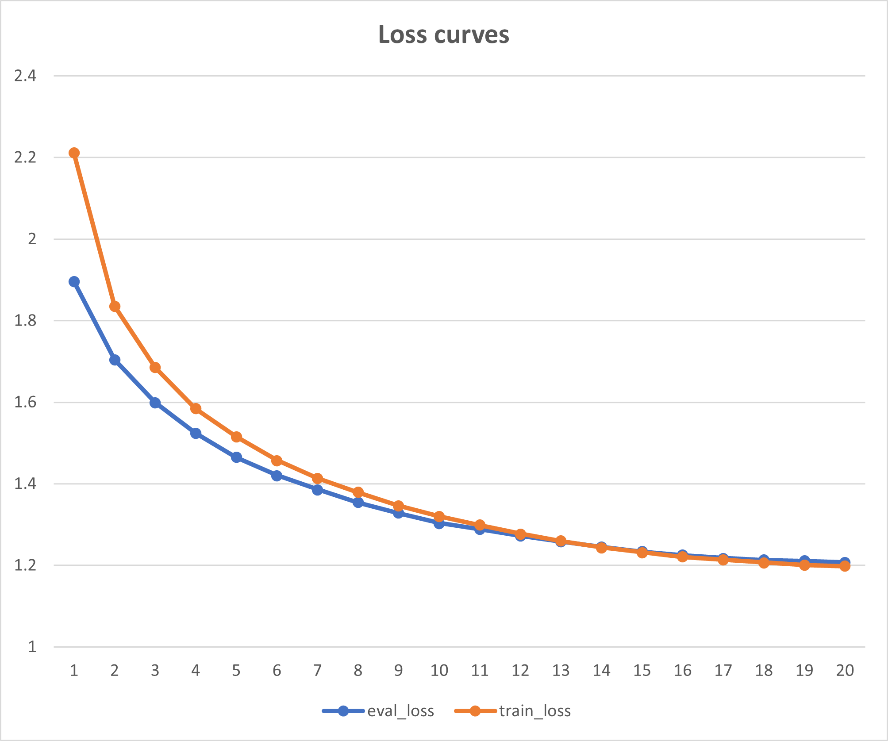
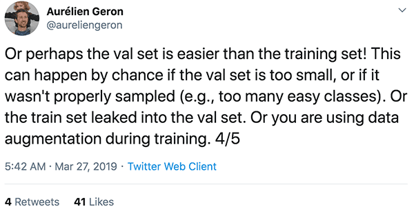

I was working on BERT continual pretraining and ran into the case where my validation loss was lower than training loss till the very last epoch or two.

  

Went online to look for explanations and found this by Aurelien Geron.

  
  
  

