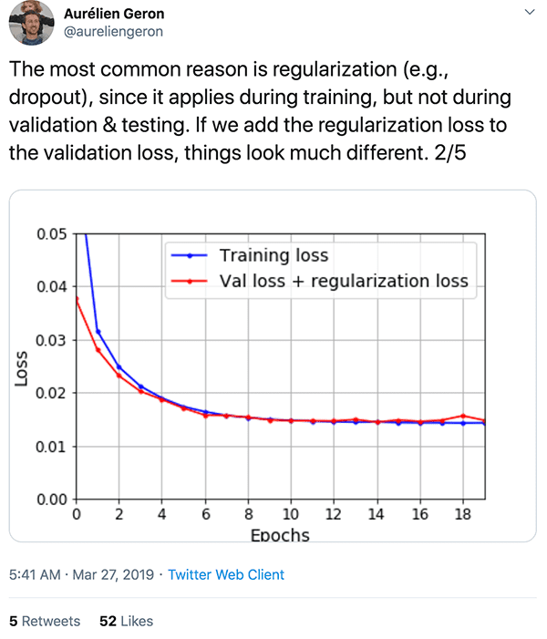

1. $W_Q, W_K, W_V$ do NOT have to of the same size as $d_model$. The multi-head matrices are fractions of $d_model$.
1. positional encoding
    1. position and order
    1. relative position and distance invariance
1. references:
    1. https://arxiv.org/pdf/1706.03762.pdf
    1. https://jalammar.github.io/illustrated-transformer/
    1. http://nlp.seas.harvard.edu/annotated-transformer/#positional-encoding
    1. https://github.com/hyunwoongko/transformer/blob/master/conf.py
    1. https://kazemnejad.com/blog/transformer_architecture_positional_encoding/

### thoughts
1. The Query, Key and Value matrices are just like the filters in CNN. Multi-head is just multi-channel.

  

Went online to look for explanations and found this by Aurelien Geron.

  
  
  

