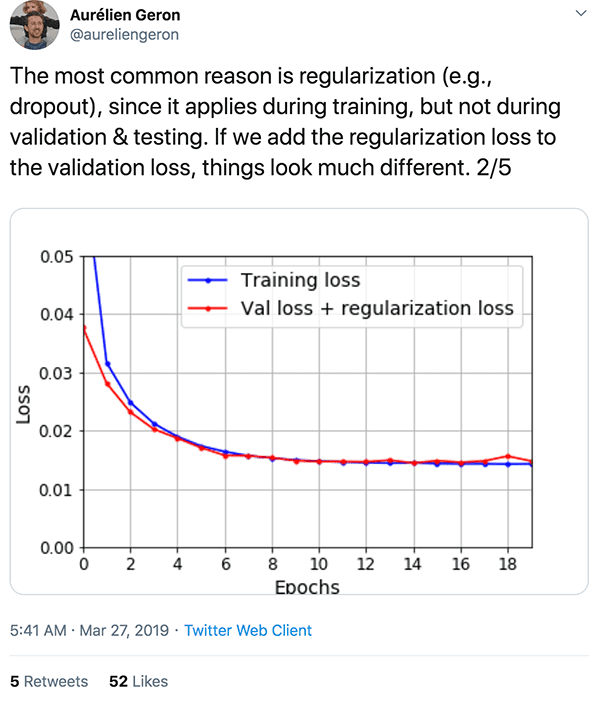
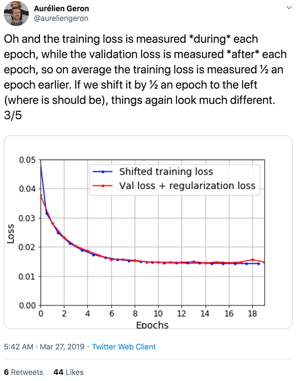

1. $W_Q, W_K, W_V$ do NOT have to of the same size as $d_model$. The multi-head matrices are fractions of $d_model$.
1. positional encoding
    1. position and order
        1. in the plot of embedding vs position. Each position is a unique combination of sinusoidal basis. Think of it as coding like (1, 0, 0), (0, 1, 0)...
    1. relative position and distance invariance
        1. https://kazemnejad.com/blog/transformer_architecture_positional_encoding/
        1. https://timodenk.com/blog/linear-relationships-in-the-transformers-positional-encoding/
1. Understand the causality mask. 
    1. It's applied on the self-attention sublayer of the decoder, not on the cross-attention. 
    1. It's applied on the attention score, not after the residual connection. The identity part still carry information from all time stamps/words.
    1. Image the <sos> -> w1, w1->w2... picture.
    1. What about the residual connection? The `x` itself does get passed over too? Actually no.
1. Cross attention
    1. $(Q K^T) V \rightarrow (n_{src} * d_{mod}) * (d_{mod} * n_{tgt}) * (n_{tgt} * d_{mod})$
    1. why no causality mask needed?
    1. parallel at train, auto-regressive at inferencing?
1. nn.Parameter, nn.register_buffer, nn.tensor
    1. https://discuss.pytorch.org/t/what-is-the-difference-between-register-buffer-and-register-parameter-of-nn-module/32723/4
    1. 
1. references:
    1. https://arxiv.org/pdf/1706.03762.pdf
    1. https://jalammar.github.io/illustrated-transformer/
    1. http://nlp.seas.harvard.edu/annotated-transformer/#positional-encoding
	1. https://github.com/jadore801120/attention-is-all-you-need-pytorch/tree/master (recommended by Noga)
    1. https://youtu.be/1biZfFLPRSY
    1. https://youtu.be/0SmNEp4zTpc
    1. https://github.com/hyunwoongko/transformer/blob/master/conf.py
    1. https://pytorch.org/tutorials/beginner/transformer_tutorial.html
    1. https://pytorch.org/docs/stable/_modules/torch/nn/modules/transformer.html#Transformer
1. training and stuff, labeling smoothing...

### thoughts
1. The Query, Key and Value matrices are just like the filters in CNN. Multi-head is just multi-channel.

  

Went online to look for explanations and found this by Aurelien Geron.

  
  
  

